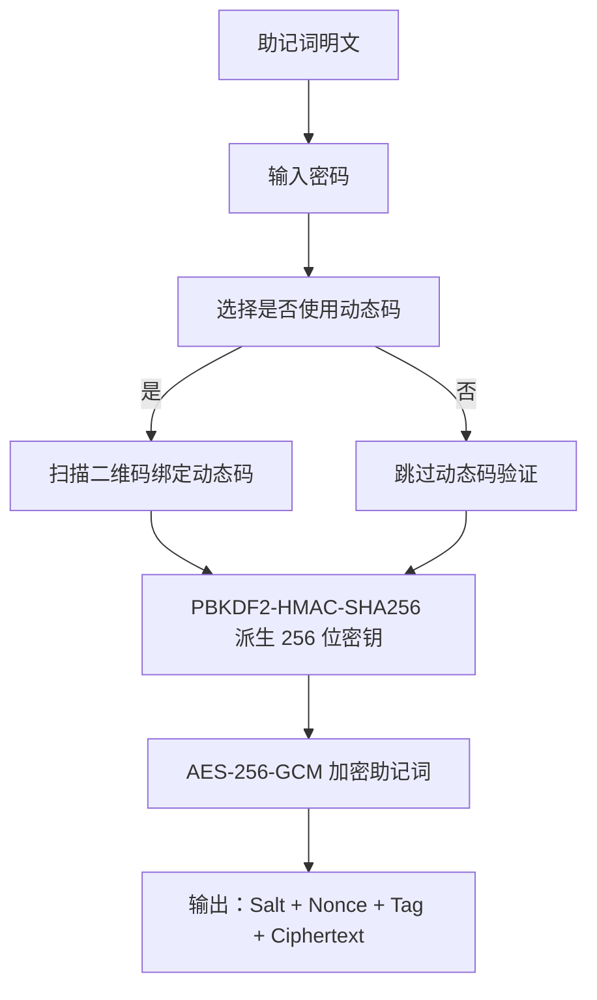
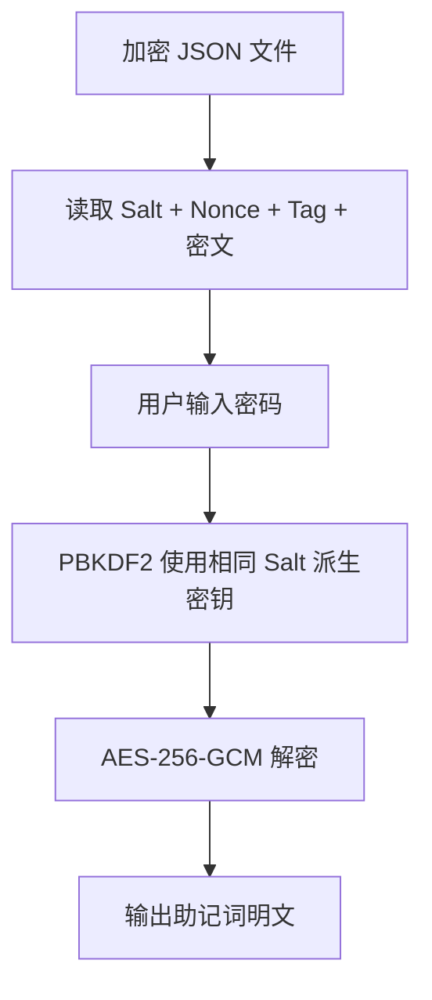
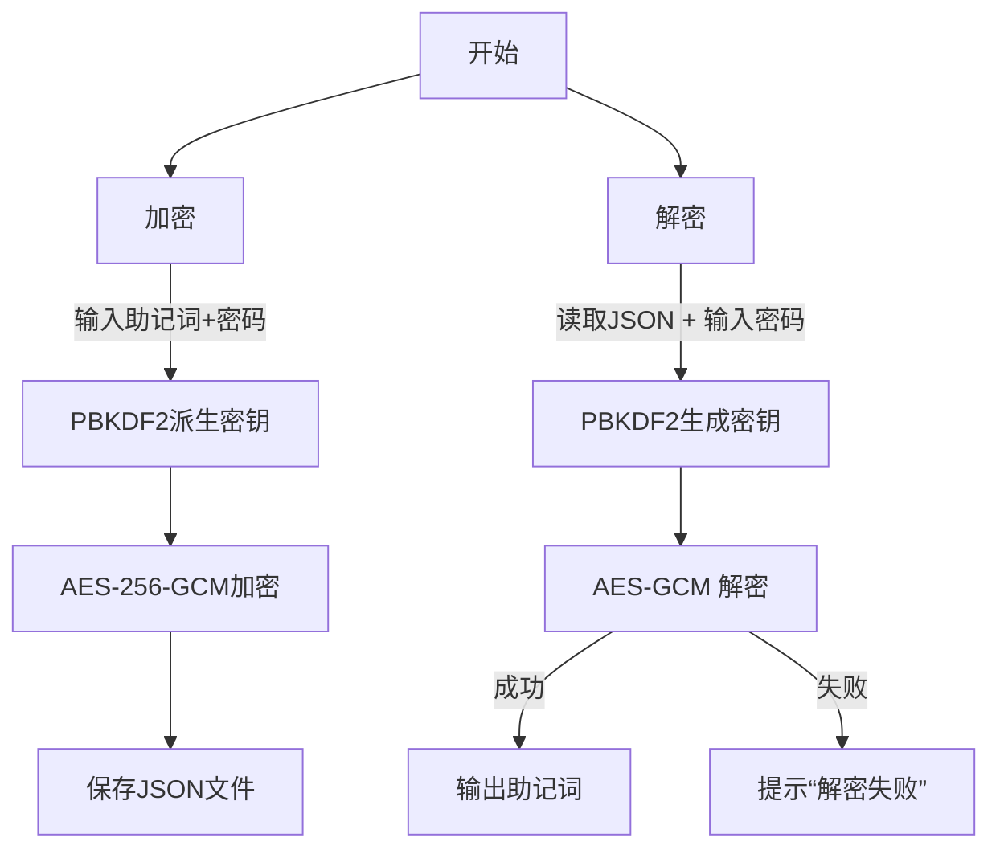

# 🛡️ 离线版助记词数据加密 & 解密完整流程指南（基于 BIP39 + AES-256 + PBKDF2）

---

## 🧩 技术概览

| 项目   | 说明                                       |
| ---- | ---------------------------------------- |
| 明文数据 | 你的钱包助记词（BIP39，例如 12/24 个英文单词）            |
| 加密算法 | AES-256-GCM（对称加密 + 完整性校验）                |
| 密钥派生 | 使用 PBKDF2-HMAC-SHA256 从密码派生密钥（含 Salt 加盐） |
| 安全增强 | 加入随机 Salt、Nonce，防止重复加密结果固定               |
| 双因素认证 | 可选的 TOTP 动态码验证，提供更高安全性                    |
| 输出格式 | JSON（包含密文 + 加密参数）                        |

---

## 🔐 第一步：准备加密数据

### ✅ 输入：

* 助记词（如：`seed brown arm ...`）
* 自定义密码（例如：`S3cure!passw0rd`）
* 是否启用动态码验证（可选，推荐启用以提供更高安全性）

---

## 🔧 第二步：加密流程（Encrypt）

### 🧠 加密流程图：



### 🧪 加密步骤详解：

| 步骤  | 操作                                              |
| --- | ----------------------------------------------- |
| 1️⃣ | 用户输入助记词（明文字符串）                                  |
| 2️⃣ | 用户输入加密密码                                        |
| 3️⃣ | 使用随机 `Salt`（16字节） 与密码生成密钥（PBKDF2，迭代 200,000 次）  |
| 4️⃣ | 使用 AES-256-GCM 模式加密助记词                          |
| 5️⃣ | 将 `Salt`、`Nonce`、`Tag` 和 `密文` base64 编码保存为 JSON |
| 6️⃣ | 生成 `mnemonic.enc.json` 文件                       |

### ✅ 示例 JSON 结构（加密输出）：

使用动态码验证时：
```json
{
  "salt": "Z4I4vp+Stnqwz4uEbNaGCg==",
  "totp": {
    "nonce": "EK8yEyGk6ICjx2lD",
    "tag": "qhvE4g+KNlcnNfAwRtXsgw==",
    "ciphertext": "Iv5F+KcHZh7It6O1Q6OsA3Rg20cSm..."
  },
  "mnemonic": {
    "nonce": "FK9yEyGk7ICjx2lD",
    "tag": "rhvE4g+KNlcnNfAwRtXsgw==",
    "ciphertext": "Jv5F+KcHZh7It6O1Q6OsA3Rg20cSm..."
  },
  "created_at": "2025-06-24T08:00:00Z"
}
```

不使用动态码验证时：
```json
{
  "salt": "Z4I4vp+Stnqwz4uEbNaGCg==",
  "mnemonic": {
    "nonce": "FK9yEyGk7ICjx2lD",
    "tag": "rhvE4g+KNlcnNfAwRtXsgw==",
    "ciphertext": "Jv5F+KcHZh7It6O1Q6OsA3Rg20cSm..."
  },
  "created_at": "2025-06-24T08:00:00Z"
}
```

---

## 🔓 第三步：解密流程（Decrypt）

### 🧠 解密流程图：



### 🧪 解密步骤详解：

| 步骤  | 操作                                                 |
| --- | -------------------------------------------------- |
| 1️⃣ | 打开 `mnemonic.enc.json` 文件                          |
| 2️⃣ | 提取并解码 base64 编码的 `salt`、`nonce`、`tag`、`ciphertext` |
| 3️⃣ | 用户输入密码                                             |
| 4️⃣ | 使用相同的 PBKDF2 参数（salt + 迭代次数）生成密钥                   |
| 5️⃣ | 使用 AES-256-GCM 解密数据                                |
| 6️⃣ | 如果密码正确且数据未被篡改，输出原始助记词；否则报错（MAC check failed）       |

---

## ✅ 第四步：加密 & 解密命令（Python 脚本）

你可以使用以下命令行工具（之前提供的 `mnemonic_encryptor.py` 脚本）：

### 🔐 加密命令

```bash
python mnemonic_encryptor.py --mode encrypt [--use-totp]
```

系统将提示输入助记词与密码，然后输出加密文件（默认：`mnemonic.enc.json`）

---

### 🔓 解密命令

```bash
python mnemonic_encryptor.py --mode decrypt --input mnemonic.enc.json [--use-totp]
```

输入密码后，输出原始助记词。


## 🎯 总结：流程图（总览）



---
