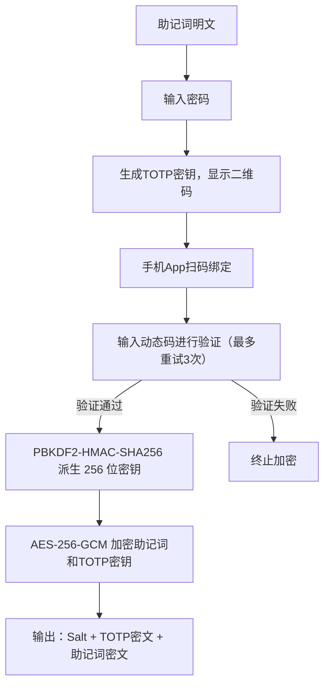
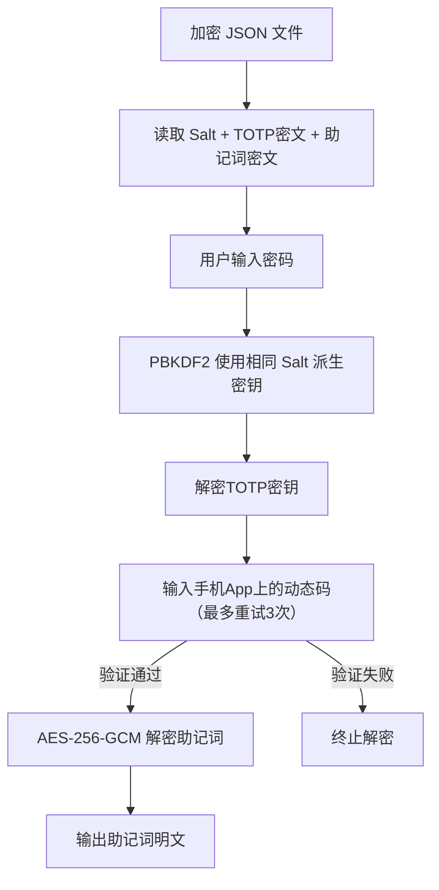
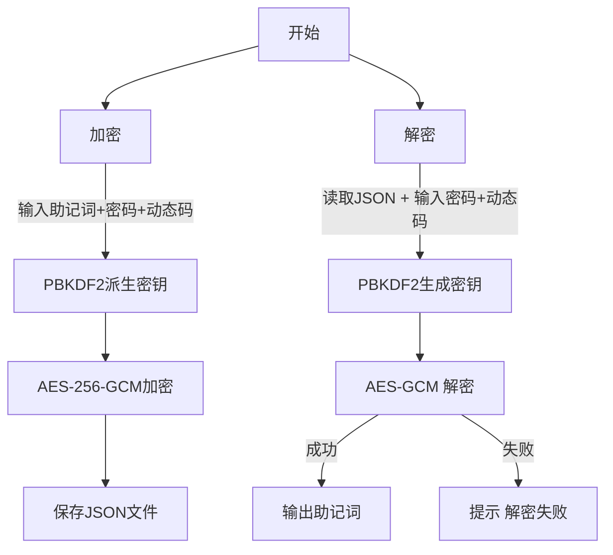

# 🛡️ 助记词数据加密 & 解密完整流程指南（基于 BIP39 + AES-256 + PBKDF2 + TOTP 动态码认证）

---

## 🧩 技术概览

| 项目   | 说明                                       |
| ---- | ---------------------------------------- |
| 明文数据 | 你的钱包助记词（BIP39，例如 12/24 个英文单词）            |
| 加密算法 | AES-256-GCM（对称加密 + 完整性校验）                |
| 密钥派生 | 使用 PBKDF2-HMAC-SHA256 从密码派生密钥（含 Salt 加盐） |
| 安全增强 | 加入随机 Salt、Nonce，防止重复加密结果固定               |
| 双因素认证 | 集成 TOTP 动态码验证，需手机App扫码绑定，解密时需输入动态码（支持重试3次） |
| 输出格式 | JSON（包含密文 + 加密参数 + TOTP 信息）                        |

---

## 🔐 第一步：准备加密数据

### ✅ 输入：

* 助记词（如：`seed brown arm ...`）
* 自定义密码（例如：`S3cure!passw0rd`）
* 手机安装 Google Authenticator、Microsoft Authenticator 等 TOTP 动态码App

---

## 🔧 第二步：加密流程（Encrypt）

### 🧠 加密流程图：



### 🧪 加密步骤详解：

| 步骤  | 操作                                              |
| --- | ----------------------------------------------- |
| 1️⃣ | 用户输入助记词（明文字符串）                                  |
| 2️⃣ | 用户输入加密密码                                        |
| 3️⃣ | 系统生成随机 TOTP 密钥，显示二维码，用户用手机App扫码绑定         |
| 4️⃣ | 用户输入手机App上的6位动态码，系统验证（最多重试3次）           |
| 5️⃣ | 验证通过后，使用随机 `Salt`（16字节） 与密码生成密钥（PBKDF2，迭代 200,000 次）  |
| 6️⃣ | 使用 AES-256-GCM 模式加密助记词和TOTP密钥                          |
| 7️⃣ | 将 `Salt`、TOTP密文、助记词密文 base64 编码保存为 JSON |
| 8️⃣ | 生成 `mnemonic.enc.json` 文件                       |

### ✅ 示例 JSON 结构（加密输出）：

```json
{
  "salt": "Z4I4vp+Stnqwz4uEbNaGCg==",
  "totp": {
    "nonce": "EK8yEyGk6ICjx2lD",
    "tag": "qhvE4g+KNlcnNfAwRtXsgw==",
    "ciphertext": "Iv5F+KcHZh7It6O1Q6OsA3Rg20cSm..."
  },
  "mnemonic": {
    "nonce": "FK9yEyGk7ICjx2lD",
    "tag": "rhvE4g+KNlcnNfAwRtXsgw==",
    "ciphertext": "Jv5F+KcHZh7It6O1Q6OsA3Rg20cSm..."
  },
  "created_at": "2025-06-24T08:00:00Z"
}
```

---

## 🔓 第三步：解密流程（Decrypt）

### 🧠 解密流程图：



### 🧪 解密步骤详解：

| 步骤  | 操作                                                 |
| --- | -------------------------------------------------- |
| 1️⃣ | 打开 `mnemonic.enc.json` 文件                          |
| 2️⃣ | 提取并解码 base64 编码的 `salt`、TOTP密文、助记词密文 |
| 3️⃣ | 用户输入密码                                             |
| 4️⃣ | 使用相同的 PBKDF2 参数（salt + 迭代次数）生成密钥                   |
| 5️⃣ | 解密TOTP密钥，提示用户输入手机App上的6位动态码，系统验证（最多重试3次） |
| 6️⃣ | 动态码验证通过后，解密助记词；否则终止并报错                   |
| 7️⃣ | 如果密码和动态码正确且数据未被篡改，输出原始助记词；否则报错（MAC check failed）       |

---

## ✅ 第四步：加密 & 解密命令（Python 脚本）

你可以使用以下命令行工具（`mnemonic_encryptor.py` 脚本）：

### 🔐 加密命令

```bash
python mnemonic_encryptor.py --mode encrypt
```

系统将提示输入助记词、密码，并显示二维码，要求用手机App扫码绑定并输入动态码（最多重试3次），然后输出加密文件（默认：`mnemonic.enc.json`）。

---

### 🔓 解密命令

```bash
python mnemonic_encryptor.py --mode decrypt --input mnemonic.enc.json
```

系统将提示输入密码和动态码（最多重试3次），验证通过后输出原始助记词。

---

## 🧯 第五步：安全建议

| 项目       | 建议                                |
| -------- | --------------------------------- |
| 密码选择     | 使用复杂度高的密码（推荐 12 位以上，含大小写、数字、符号）   |
| 动态码App   | 建议使用 Google Authenticator、Microsoft Authenticator 等主流App |
| 加密文件存放   | 存于本地离线盘、U盘或加密硬盘，不建议存网盘            |
| 密钥派生参数   | 使用 200,000 次迭代可大幅提升抗暴力破解能力        |
| 不要写死密码   | 密码不应写入脚本中，应使用输入提示获取               |
| 多重备份（可选） | 可配合 Shamir Secret Sharing 等机制分片保存 |
| 身份验证（可选） | 已集成 TOTP 动态码双因素认证，绑定时务必验证成功后再完成加密         |

---


## 🖥️ 第六步：打包为应用（.exe/.pkg）

### 1. 安装 PyInstaller

在命令行输入（只需安装一次）：
```bash
pip install pyinstaller
```

### 2. 打包命令

在脚本所在目录下执行：
```bash
pyinstaller mnemonic_encryptor.spec
```

### 3. 打包结果

- 打包完成后，在 `dist` 文件夹下会生成 `mnemonic.exe`
- 你可以将该文件拷贝到任意 Windows 电脑运行，无需 Python 环境

### 4. 常见问题

- 如果运行 .exe 时提示缺少依赖，请确保所有依赖都已通过 pip 安装
- 避免中文路径，防止编码问题
- 如需自定义图标，可加 `--icon=youricon.ico` 参数

### 5. 依赖说明

打包前请确保已安装所有依赖：
```bash
pip install cryptography pyotp qrcode[pil]
```


## 🎯 总结：流程图（总览）



